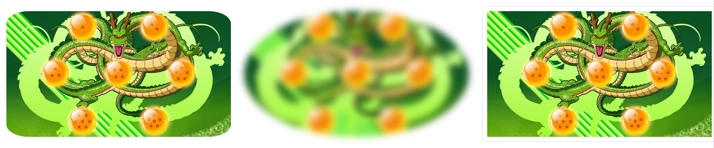
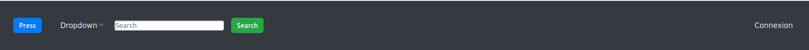

[![LinkedIn][linkedin-shield]][linkedin-url]


<!-- PROJECT LOGO -->
<br />
<p align="center">
  <a href="https://github.com/Heifarabuval/Css-Generator/tree/master/MergeImgCssGenerator">
    
  </a>
 
  <h3 align="center">Css Framework</h3>

  <p align="center">
    Quickly design and customize responsive pages. 
    <br />
    <br />
  </p>


<!-- TABLE OF CONTENTS -->
<details open="open">
  <summary>Table of Contents</summary>
  <ol>
    <li><a href="#about-the-project">About The Project</a></li>
    <li><a href="#installation">Installation</a></li>
    <li><a href="#usage">Usage</a>
    <ul>
        <li><a href="#Responsive">Responsive</a></li>
        <li><a href="#Buttons">Buttons</a></li>
        <li><a href="#Images">Images</a></li>
        <li><a href="#Alerts">Alerts</a></li>
        <li><a href="#Navbar">Navbar</a></li>
        <li><a href="#ModalView">Modal view</a></li>
    </ul>
    </li>
  </ol>
</details>


<!-- ABOUT THE PROJECT -->
## About The Project

[![Product Name Screen Shot][product-screenshot]](readMeImg/nav.png)

This project reproduce a number of bootstrap features.

Restrictions:
* Use ````Sass```` for css part
* Use ````Jquery```` for javascript part


<!-- GETTING STARTED -->
### Installation

What you need to use the framework and how to install it:
1. First import jQuery library in your HTML head before including the framework :
  ```html
  <script src="https://ajax.googleapis.com/ajax/libs/jquery/3.5.1/jquery.min.js"></script>
  ```

2. Import the framework: 
  ```html
  <script rel="script" src="Scripts/main.js"></script>
  ```
  
Now you should be able to use the framework.
    

<!-- USAGE EXAMPLES -->
## Usage
### Responsive
Create responsive view using **col-** class :
```html
<div class="container">
    <div class="row">
        <div class="col-12-xs col-12-sm col-12-md col-12-lg box box--blue">Box1</div>
        <div class="col-12-xs col-12-sm col-6-md col-3-lg box box--violet">Box2</div>
        <div class="col-12-xs col-12-sm col-6-md col-3-lg box box--red">Box3</div>
        <div class="col-12-xs col-12-sm col-6-md col-3-lg box box--yellow">Box4</div>
        <div class="col-12-xs col-12-sm col-6-md col-3-lg box box--green">Box5</div>
    </div>
</div>
```
Scss 

```scss
.box{
  padding-bottom: 50px;
  box-sizing: border-box;
  margin: 5px;

  &--blue{
    background-color: blue;
  }
  &--violet{
    background-color: blueviolet;
  }
  &--red{
    background-color: red;
  }
  &--yellow{
    background-color: yellow;
  }
  &--green{
    background-color: green;
  }
}
```


**Result**

<div align="center">

<table>
<tr>
    <td valign="top"> Laptop </td>
    <td valign="top"> Tablet </td>
    <td valign="top"> Phone </td>
  </tr>
  <tr>
    <td valign="top"></td>
    <td valign="top"></td>
    <td valign="top"></td>
  </tr>
</table>

</div>

<br>

### Buttons

Create buttons using **btn-** class :
```html
<button type="button" class="btn">Button basic</button>
<button type="button" class="btn-default">Button default</button>
<button type="button" class="btn-primary btn-lg" disabled>Button primary large</button>
<button type="button" class="btn-success btn-sm">Button success small</button>
<button type="button" class="btn-info btn-xs">Button info</button>
<button type="button" class="btn-warning">Button warning</button>
<button type="button" class="btn-danger">Button danger</button>
<button type="button" class="btn-link">Button link</button>
```
**Result**


<br>

### Images

Change images style using **images-** class :
```html
<div class="row">
    <div class="img-container col-4-lg col-4-sm col-4-md col-4-xs"></div>
    <div class="img-container col-4-lg col-4-sm col-4-md col-4-xs"></div>
    <div class="img-container col-4-lg col-4-sm col-4-md col-4-xs"></div>
</div>
```
**Result**

<br>

### Text background & font color

Change text background & font color: font: **text-** | background: **bg-** :
```html
<div class="text-container row">
    
    //Text color
    <div class="col-6-lg col-6-md col-6-sm col-6-xs">
        <p class="text-muted">Muted</p>
        <p class="text-primary">Primary</p>
        <p class="text-success">Success</p>
        <p class="text-info">Info</p>
        <p class="text-warning">Warning</p>
        <p class="text-danger">Danger</p>
        <p class="text-secondary">Secondary</p>
        <p class="text-dark">Dark</p>
        <p class="text-body">Body</p>
        <p class="text-white">White</p>
    </div>
    
    //Background text color
    <div class="col-6-lg col-6-md col-6-sm col-6-xs">
        <p class="bg-muted text-white">Muted</p>
        <p class="bg-primary text-white">Primary</p>
        <p class="bg-success text-white">Success</p>
        <p class="bg-info text-white">Info</p>
        <p class="bg-warning text-white">Warning</p>
        <p class="bg-danger text-white">Danger</p>
        <p class="bg-secondary text-white">Secondary</p>
        <p class="bg-dark text-white">Dark</p>
        <p class="bg-body text-white">Body</p>
        <p class="bg-light">Body</p>
    </div>
</div>
```
**Result**


<br>

### Alerts

Create box alerts using **alert-** class :
```html
<div class="row">
    <div class="alert-container col-6-xs col-6-sm col-6-md col-6-lg">
        <div class="alert-success">Success alert</div>
    </div>
    <div class="alert-container col-6-xs col-6-sm col-6-md col-6-lg">
        <div class="alert-success">Success alert</div>
    </div>

    <div class="alert-container col-12-xs col-12-sm col-12-md col-12-lg">
        <div class="alert-info">Info alert</div>
    </div>
    <div class="alert-container col-12-xs col-12-sm col-12-md col-12-lg">
        <div class="alert-warning"> Warning alert</div>
    </div>
    <div class="alert-container col-12-xs col-12-sm col-12-md col-12-lg">
        <div class="alert-danger">Danger alert</div>
    </div>
</div>
```
**Result**
<br>


### Navbar

Create complex navbar with dropdowns:
```html
<nav class="navbar">
    <div class="navbar-header">
        <a class="navbar-brand" href="#">
            
        </a>

    </div>
    <ul class="navbar-nav">
        <li class="active"><a class="nav-link" href="#">Home</a></li>
        <li>
            <a class="nav-link dropdown" href="#">Dropdown<span class="caret"></span></a>
            <div class="dropdown-menu">
                <a href="#" class="dropdown-item">Link1</a>
                <a href="#" class="dropdown-item">Link2</a>
                <a href="#" class="dropdown-item">Link3</a>
                <a href="#" class="dropdown-item">Link4</a>
            </div>
        </li>

        <li><a class="nav-link" href="#">Page 1</a></li>
        <li><a class="nav-link" href="#">Page 2</a></li>

        <li>
            <a  class="nav-link dropdown" href="#">Dropdown 2<span class="caret"></span></a>
            <div class="dropdown-menu">
                <a href="#" class="dropdown-item">Link1</a>
                <a href="#" class="dropdown-item">Link2</a>
                <a href="#" class="dropdown-item">Link3</a>
                <a href="#" class="dropdown-item">Link4</a>
            </div>
        </li>
        <li>
            <a class="nav-link" href="#">Page 3</a>
        </li>
    </ul>
    <ul class="navbar-nav navbar-right">
        <li><a href="#">Connexion</a></li>
    </ul>
</nav>
```
**Result**
<br>


If you prefer dark nav bar you can add to your nav **bg-dark** class :
```html
<nav class="navbar bg-dark">
```
**Result**


<br>

### ModalView

Create modal view using **modal-** class :
```html
   <button type="button" class="btn btn-primary">Button basic</button>
<button type="button" class="btn btn-default" data-target="myModal">Button default/ active modal view</button>
<div id="myModal" class="modal container">
    <div class="modal-content">
        <div class="modal-header">Modal view</div>
        <div class="modal-message">Message to pop</div>
        <div class="container">
            <div class="row">
                <div style="background-color: #e0d6d6" class="box col-12-lg col-12-md col-12-sm col-12-xs"></div>
                <div style="background-color: #474b53" class="box col-6-lg col-6-md col-12-sm col-12-xs"></div>
                <div style="background-color: #70c2d1" class="box col-6-lg col-6-md col-12-sm col-12-xs"></div>
            </div>
        </div>
    </div>
</div>
```
**Result**
<br>

<br>

### Tabs

Create modal view using **tab-** class :
```html
    <div class="tabs-container">
    <div class="tab-content">
        <ul class="tab-list">
            <li class="tab-item active" data-target="tab1">Tab 1</li>
            <li class="tab-item" data-target="tab2">Tab 2</li>
            <li class="tab-item" data-target="tab3">Tab 3</li>
        </ul>
        <div  class="tab-pane active" id="tab1">Content Tab 1</div>
        <div  class="tab-pane" id="tab2">Content Tab 2</div>
        <div class="tab-pane" id="tab3">Content Tab 3</div>
    </div>
</div>
```
**Result**
<br>


<br>

### Tooltip

Create tooltip  using **tooltip** class :
```html
    <div>
    <button type="button"  class="btn-danger tooltip" title="right" data-bgcolor="#007bff" data-placement="right">Button danger right</button>
    <button type="button"  class="btn-danger tooltip" title="left" data-placement="left">Button danger left</button>
    <button type="button"  class="btn-danger tooltip" title="top" data-placement="top">Button danger top</button>
    <button type="button"  class="btn-danger tooltip" title="bottom" data-placement="bottom">Button danger bottom</button>
</div>
```
**Result**
<br>


<br>

### Hide print

Hide element when printing using **hidden-print** class :
```html
<div style="font-size: 200px" class="hidden-print">Hidden Print</div>
```

<!-- CONTRIBUTING -->
## Contributing

Contributions are what make the open source community such an amazing place to learn, be inspired, and create. Any contributions are **greatly appreciated**.

1. Fork the Project
2. Create your Feature Branch (`git checkout -b feature/AmazingFeature`)
3. Commit your Changes (`git commit -m 'Add some AmazingFeature'`)
4. Push to the Branch (`git push origin feature/AmazingFeature`)
5. Open a Pull Request


<!-- LICENSE -->
## License

Free license

<!-- CONTACT -->
## Contact

Heifara BUVAL - [linkedIn](https://www.linkedin.com/in/heifara-buval-b1662914a/) - heifara.buval@epitech.eu

Project Link: [https://github.com/Heifarabuval/Css-Generator](https://github.com/Heifarabuval/Css-Generator)


<!-- MARKDOWN LINKS & IMAGES -->
[linkedin-shield]: https://img.shields.io/badge/-LinkedIn-black.svg?style=for-the-badge&logo=linkedin&colorB=555
[linkedin-url]: https://www.linkedin.com/in/heifara-buval-b1662914a/
[product-screenshot]: readMeImg/nav.png
